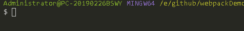

> 一些`webpakc`插件使用操作说明。

所有的这些操作说明都是查询[npm 官网查询](https://www.npmjs.com/)。未全部列出，其他请自行查阅。

####  `ora`

控制台格式化输出加载内容`loading...`。

说明：

* 调用`ora`若传入字符串，则作为初始文本展示在控制台；若传入对象，则有多个属性设置。
* 调用`start`方法开始执行，并返回一个`ora`实例。可传入字符串作为显示文本，会被ora `opitions`中的属性`text`覆盖。
* `spinner`为字符串时windows下默认`—`，可通过对象方式设置`frames`多个加载标识。
* 通过实例`spinner`可调用属性进行修改。
* 通过调用`stop`结束操作并清除控制台中的信息。
* `succeed()/fail()/warn()/info()`可打印状态信息，对应不同的标识。

```js
const ora = require("ora");

// const spinner = ora('Loading ... ').start();
spinner = ora({
    text:"Loading ...",       // 初始显示文本
    prefixText:"pre",     // 在加载符号之前的文本  
    // spinner:"-",
    spinner:{             // 加载标识定义
        interval:800,
        frames:['-','+','$']
    },
    color:"green",         // 加载标识颜色定义'black' 'red' 'green' 'yellow' 'blue' 'magenta' 'cyan' 'white' 'gray'   
    indent:10,        // 加载时行的缩进
}).start("start...");
setTimeout(()=>{
    spinner.color= "yellow";
    spinner.text = "load complete!";

    spinner.stop("stop");
    // spinner.succeed("success!");
},1000);
```
操作演示：




#### `chalk`

格式输出终端文本的样式。

说明：

* 可链式调用指定样式，同名属性后者覆盖前面的。
* 可控制设置可使用的颜色(未操作)
* 文本操作样式格式化：

  <table border="1">
    <thead>
        <tr>
            <td>分类</td>
            <td>属性名</td>
            <td>说明</td>
            <td></td>
        </tr>
    </thead>
    <tbody>
        <tr>
            <td rowspan="4">字体样式类</td>
            <td></td>
            <td></td>
            <td></td>
        </tr>
        <tr>
            <td>字体样式类</td>
            <td></td>
            <td></td>
            <td></td>
        </tr>
        <tr>
            <td>字体样式类</td>
            <td></td>
            <td></td>
            <td></td>
        </tr>
        <tr>
            <td>文本颜色</td>
            <td></td>
            <td></td>
            <td></td>
        </tr>
        <tr>
            <td>背景颜色</td>
            <td></td>
            <td></td>
            <td></td>
        </tr>
    </tbody>
  </table>

```js
const chalk = require('chalk');

let log = console.log;
log(chalk.red("start..."));
```